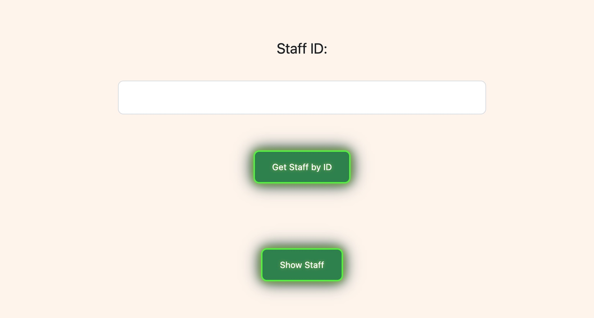
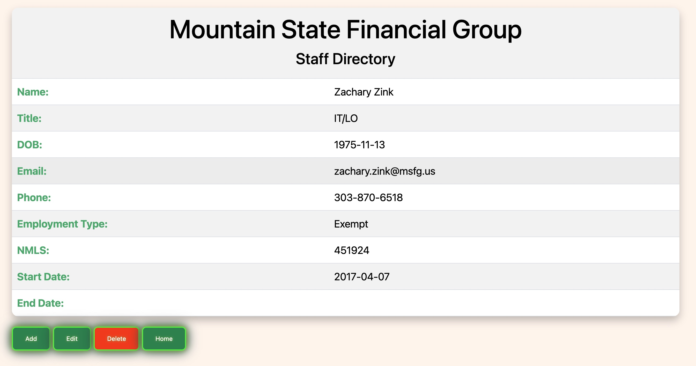
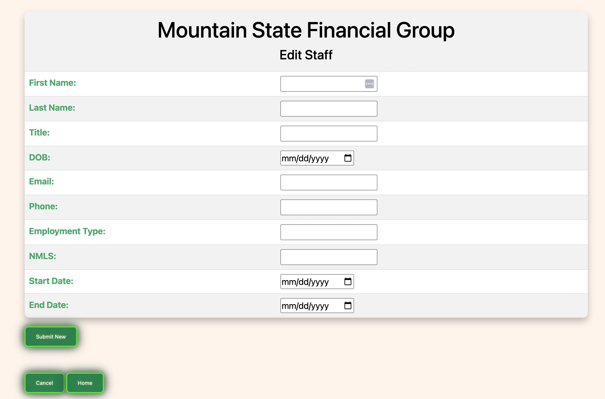
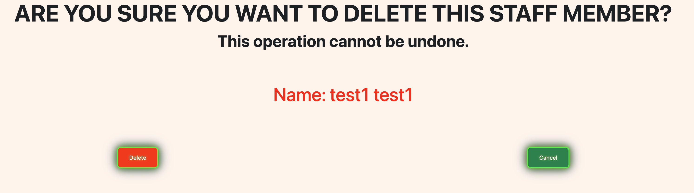
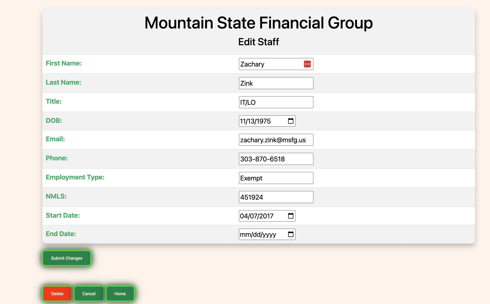
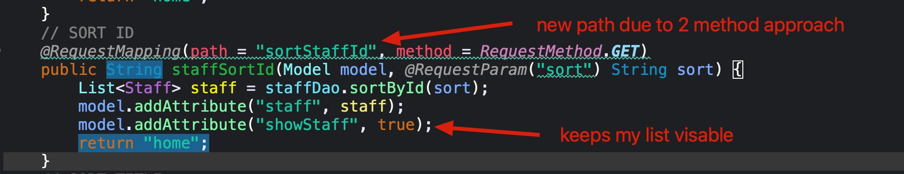
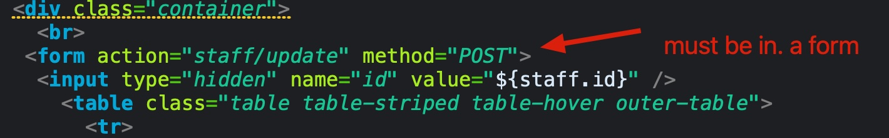
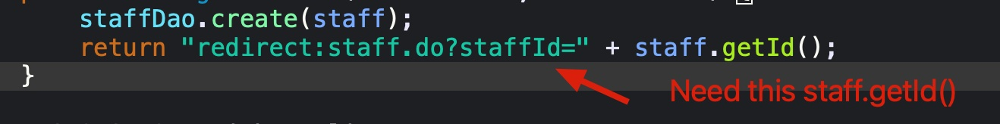

# JPACRUDProject

# MSFG STAFF DATABASE


## DESCRIPTION

- [x] Your project utilizes a MySQL database to manipulate data. For this project you are only required to have a single table and entity.
- [x] A Spring project allows for a user to perform basic CRUD operations on your entity via a web interface.
- [ ] Your project and database are deployed to your AWS instance.

## Technologies used

 - Java
 - Eclipse
 - Git/GitHub
 - Sublime Text Editor
 - zsh
 - Sublime
 - sql
 - MAMP
 - Spring Boot
 - Spring Initializr
 - sql workbench
 - jsp/Graddle/Goo
 - HTML/CSS
 - https://dev.mysql.com/doc/
 - https://www.w3schools.com/tags/default.asp
 - https://getbootstrap.com/docs/5.3/components

## DataBase Diagram


## Setup

Workspace Folder and Git Setup
Create a workspace for the project:
```
			mkdir ~/SD/Java/JPACrudProject
````
Create a .gitignore:
```
			cd ~/SD/Java/JPACrudProject/
````
````
subl .gitignore
.DS_Store
Servers
target
build
bin
default
.metadata
.settings
.gradle
*.war 
*.bak
````
Create a Github repository named JPACRUDProject.

Copy the repository initialization commands from the repo page and run them in your ~/SD/Java/JPACrudProject/ folder.

Do another git add . and a git commit -m "Add .gitignore".

Be sure to add, commit, and push frequently throughout this project; for example, after completing each of the following setup sections would be a good time for a git commit.

MySQL Schema Setup
Create a folder for your database development files:
```
			mkdir ~/SD/Java/JPACrudProject/DB
````
Create a MySQL Workbench schema model.

Set the name of the database physical schema to an appropriate name (we'll use myprojectdb as an example).

Create username@localhost user with table.modify role for your database, where "username" is specific to your project.

Make a note of your:
Schema name
Username
Password
Save the MWB file to ~/SD/Java/JPACrudProject/DB/myprojectdb.mwb (where myprojectdb is a name appropriate for your schema.)

Create your entity table with an appropriate table name.

Give it an id INTEGER primary key column with AutoIncrement.
Add one other column for now so you can test your Persistence Unit configuration.
In the Inserts tab, add one row of data with a column value we can check in a JUnit entity test; make sure to hit Apply Changes, then save your MWB file and forward engineer the schema.
Project Workspace Setup
In STS, use File | Open Workspace to open your JPACrudProject folder while also leaving VideoStore open for reference.

In the STS Preferences, change the following settings:

Gradle: Specific Gradle version (current latest version)
Run/Debug | Console: UN-check Limit console output.
General | Workspace: Show full workspace
Apply and Close

 - JPA Project Setup
Setup a JPA project for your JPA entity(s) and tests.
Create a new JPA Project with an appropriate name.
Add new source folders to the build path:
src/main/resources
src/test/java
src/test/resources
Under JPA implementation, choose Disable Library Configuration
Do NOT open the JPA perspective.
Move the META-INF folder from src/main/java to src/main/resources.
Configure Gradle
Add Gradle Nature to the project.
Open the Gradle Tasks view.
Under the build setup task group, run the init task.
Go to the Console view to answer the required questions, making sure you choose Groovy as the DSL.
Refresh the Package Explorer view to see the new gradle files.
Copy the contents of the build.gradle from the JPAVideoStore project into your new project's build.gradle; save and Gradle Refresh.

 - Configure the JPA Persistence Unit
Copy the log4j2.properties file from JPAVideoStore into your new project's src/main/resources and src/test/resources folders.
From the JPAVideoStore persistence.xml copy the contents from between the <persistence-unit> tags (not the whole file) into your new project's persistence.xml, between the opening and closing <persistence-unit> tags.
Change the schema name in the JDBC URL to the name you gave your schema.
Set the values for user and password to the application user you created in your model.
Stub out and test your entity
Choose an approriate package name for your project and change the <class> declaration with a new package name and the name of your entity class.
Create the new package and entity class in src/main/java.
Add the id field and one other field in the class (leave the rest for later).
Add no-arg ctor, gets/sets, toString, etc.
Annotate your entity.
Create a matching package under src/test/java and create a new JUnit test case for your entity.
Build out the JUnit test until it passes.

 - Create a Spring Boot Project for your MVC controller, DAO, and DAO implementation.
Copy the base package name from your entity class (the package name up to but not including .entities)

Create a new Spring Starter Project.

Paste the base package name into the Package field.

Give the project an appropriate name (this project name will appear in the URL once you deploy the project.)

Set the Type to Gradle - Groovy

Set the Java Version to 21.

Set the Packaging to War.

Add the Spring Web, Spring Data JPA, and MySQL Driver dependencies.

Add JSP dependencies to the dependencies block in the Boot project's build.gradle:
```
   implementation group: 'jakarta.servlet.jsp.jstl', name: 'jakarta.servlet.jsp.jstl-api', version: '3.0.0'
   implementation 'org.glassfish.web:jakarta.servlet.jsp.jstl:3.0.0'
   compileOnly group: 'jakarta.servlet', name: 'jakarta.servlet-api', version: '6.0.0'
   implementation 'org.apache.tomcat.embed:tomcat-embed-jasper' 
   implementation 'org.glassfish.expressly:expressly:6.0.0-M1'

   ````
Add above repositories:
````
eclipse.wtp.facet {
   facet name: 'jst.web', version: '6.0'
}
````
Connect the projects using your Boot project's settings.gradle and build.gradle.

Do a Gradle refresh.

Update the Boot project's application.properties using the one from the BootMVCVideoStore application.

Choose an unused port number.
Change the schema name in the datasource URL, the username, and the password to match your MySQL schema model.
Under src/main create webapp/WEB-INF/ for your JSPs.

Static content (HTML, CSS, image files) will go in src/main/webapp/.
Create packages for your controller and DAO, and get a basic controller route and JSP view working.

Next Steps
Finish designing your database schema. This will be a single-table application. After completing the column definitions of your entity table, add data for them in the Inserts tab and forward engineer.

Update your Java entity class adding fields for your new columns. Don't forget getters/setters and a toString, and update the JUnit test appropriately.

With your DB and entity complete you can focus on implementing CRUD using MVC.

As you work, commit and push frequently.

## Plan

### 1. Requirements & Planning

decided to create a DB of the company staff of which i intend to expand on in future projects. 
We created a DB using Workbench and tied it in using Spring Book
My plan is for a very simple layout that is clean and easy to use. 

### 2. Design & Architecture
The setup for this project is a JPA Project using Gradel connected to a Spring Boot project. 
Entities are stored and tested in the JPAMSFG. 
DAO, Controller and webfiles are in the MSFGStaff project. 
Using the DalImlp for basic CRUD SQL commands and the condroller for functionality. 

### 3. Functionality

	- hide/show button for table for Staff
	- Names are link to Staff Directory
	- Sort by Name, Title, and Id
	- Add link at bottom of table adds new row
	- submit new button on staff update row on id
	- edit page show ID that cooesponds to staff page
	- delete button goes to delete page which displays name
	- delete button removes row







### 4. Testing & Debugging

Did most of the testing through the localHost
Tested the entity int the JPA


### Leasons Learned
- setup it complex and must be done with accuracy
- once the cor setup of the Hybernation project and the boot project are complete, most the website funtionality code is done in the controller. at least for this project. 
- SQL command go in the StaffDaoImlp
- Method need to be done in forms, 1 method per path. The .do notation is not required. 
- date formating is an issue. 
- jpql commands dont use get or set methods nor do they use the snake case from the SQL column
- if you add a Boolean parameter is will default required to true and will through an exception unless you force it to false. 
- important syntax for redictection. return "redirect:/staff.do?staffId=" + staff.getId();





### Notes


 - TODO: implement to AWS EC2


Userful Code in JSP
```
//SHOWS editstaff
	@RequestMapping(path = "editstaff.do", method = RequestMethod.GET)
	public String showEditStaff(@RequestParam("id") int id, Model model) {
		Staff staff = staffDao.staffId(id);
		model.addAttribute("staff", staff);
		return "staff/editstaff";
    }//EDITS STAFF
	@RequestMapping(path = "staff/update", method = RequestMethod.POST)
	public String updateStaff(Staff staff) {
		staffDao.update(staff);
		return "redirect:/staff.do?staffId=" + staff.getId();
	} //SHOWS Staffform
	@RequestMapping(path = "staffform", method = RequestMethod.GET)
	public String showStaffForm(Model model) {
	    model.addAttribute("staff", new Staff());
	    return "staff/staffform";
	}//CREATES STAFF
	@RequestMapping(path = "staffcreate", method = RequestMethod.POST)
	public String newStaff(Staff staff, Model model) {
	    staffDao.create(staff);
	    return "redirect:staff.do?staffId=" + staff.getId();
	}
```
Application.properities
```
spring.application.name=MSFGStaff

#### PORT CONFIG ####
##### Alternate Tomcat port
server.port=8082


#### JSP VIEW RESOLVER ####
##### Include to use a ViewResolver to shorten the names of your views
spring.mvc.view.prefix: /WEB-INF/
spring.mvc.view.suffix: .jsp


#### MYSQL DATASOURCE ####
##### Configure to match your Database
spring.datasource.url=jdbc:mysql://localhost:3306/msfgstaffdb
spring.datasource.username=*******
spring.datasource.password=*******
spring.datasource.driver-class-name=com.mysql.cj.jdbc.Driver


#### LOGGING ####
##### Set to WARN for fewer log messages
logging.level.root=WARN
logging.level.org.springframework.web=DEBUG
logging.level.org.hibernate.SQL=WARN
logging.level.org.hibernate.type=WARN
spring.jpa.show-sql=true


#### TOMCAT ####
spring.datasource.tomcat.max-active=10
spring.datasource.dbcp2.max-idle=8
spring.datasource.dbcp2.min-idle=8`

```

Added Headshots just to run throught hte process again. 

ZVZ

